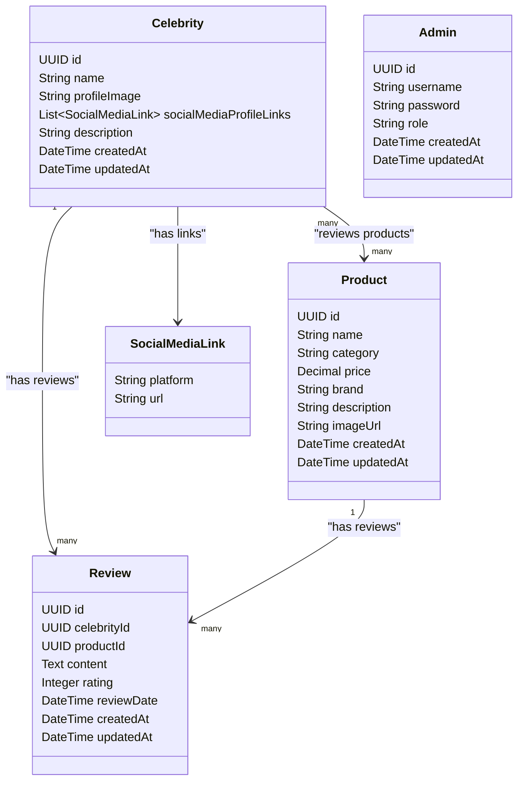
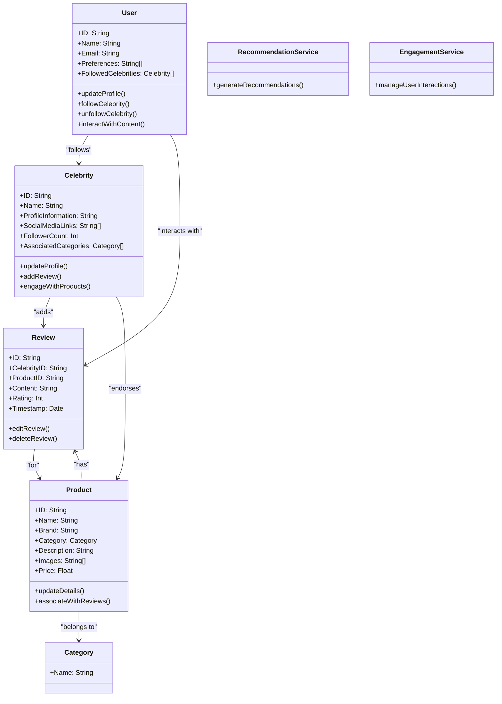

```mermaid
classDiagram
    class Celebrity {
        UUID id
        String name
        String profileImage
        List~SocialMediaLink~ socialMediaProfileLinks
        String description
        DateTime createdAt
        DateTime updatedAt
    }

    class Product {
        UUID id
        String name
        String category
        Decimal price
        String brand
        String description
        String imageUrl
        DateTime createdAt
        DateTime updatedAt
    }

    class Review {
        UUID id
        UUID celebrityId
        UUID productId
        Text content
        Integer rating
        DateTime reviewDate
        DateTime createdAt
        DateTime updatedAt
    }

    class Admin {
        UUID id
        String username
        String password
        String role
        DateTime createdAt
        DateTime updatedAt
    }

    class SocialMediaLink {
        String platform
        String url
    }

%% Relationships
    Celebrity "1" --> "many" Review : "has reviews"
    Product "1" --> "many" Review : "has reviews"
    Celebrity "many" --> "many" Product : "reviews products"
    Celebrity --> SocialMediaLink : "has links"

```

```mermaid
classDiagram
    class Celebrity {
        +ID: String
        +Name: String
        +ProfileInformation: String
        +SocialMediaLinks: String[]
        +FollowerCount: Int
        +AssociatedCategories: Category[]
        +updateProfile()
        +addReview()
        +engageWithProducts()
    }

    class Product {
        +ID: String
        +Name: String
        +Brand: String
        +Category: Category
        +Description: String
        +Images: String[]
        +Price: Float
        +updateDetails()
        +associateWithReviews()
    }

    class Review {
        +ID: String
        +CelebrityID: String
        +ProductID: String
        +Content: String
        +Rating: Int
        +Timestamp: Date
        +editReview()
        +deleteReview()
    }

    class User {
        +ID: String
        +Name: String
        +Email: String
        +Preferences: String[]
        +FollowedCelebrities: Celebrity[]
        +updateProfile()
        +followCelebrity()
        +unfollowCelebrity()
        +interactWithContent()
    }

    class Category {
        +Name: String
    }

    class RecommendationService {
        +generateRecommendations()
    }

    class EngagementService {
        +manageUserInteractions()
    }

    Celebrity --> Review : "adds"
    Product --> Review : "has"
    User --> Celebrity : "follows"
    User --> Review : "interacts with"
    Review --> Product : "for"
    Celebrity --> Product : "endorses"
    Product --> Category : "belongs to"

```